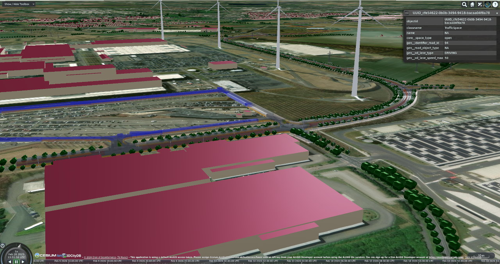

# citydb-3dtiler

!!! warning "This application is in the testing phase"

    This application is still in the testing phase. Please exercise caution when using it in production. Therefore, feedback is always welcome. Please feel free to create an issue on the GitHub page or contact me: murat.kendir(At)tum.de

This application can create 3DTiles (v 1.0 and 1.1) by reading features (aka. city objects) from 3DCityDB (v5.x), a database application that can import CityGML 2.0 or 3.0-based datasets. The application's key features are as follows:
- It can generate summary reports by reading the database or calculate the most efficient configuration parameters for creating 3D Tiles.
- It can assign colors or (PBR) materials based on object classes or the current property values of features.
- It can create separate 3DTiles based on object classes.
- Tilesets can be customized with a simple CSV file listing materials.

!!! info "Links for relevant libraries"

    - 3DCityDB: [docs.3dcitydb.org/edge](https://docs.3dcitydb.org/edge/){:target="_blank"}
    - pg2b3dm: [github.com/Geodan/pg2b3dm](https://github.com/Geodan/pg2b3dm){:target="_blank"}

!!!+ note "Features Not Yet Supported"

    - Feature Textures
    - Implicit Features (Features represented within local coordinate systems)

<figure style="width:%100;text-align: center;">
  
  <figcaption>A 3DTiles sample represents the city objects of Leipzig city</figcaption>
</figure>
 
## Documentation

- [How to use with Docker?](how_to_use_w_docker.md)
- [How to use with VENV?](how_to_use_w_venv.md)
- [All Commands & Samples](all_commands_samples.md)
- [Tips for Docker Usage](tips_for_docker_usage.md)
- [Test Procedures & Sample Tilesets](test_procedures.md)
- [Documentation for the Developers](developer_docs.md)

## Special Thanks

This application is based on two important concepts and aims to bridge the gap between the concepts 3DTiles and CityGML.
To bridge this gap, two main elements have been used in this software:

1. 3DCityDB v5
2. pg2b3dm

***We would like to take this opportunity to thank Bert Temme, the developer of the pg2b3dm library, and all 3DCityDB developers.***