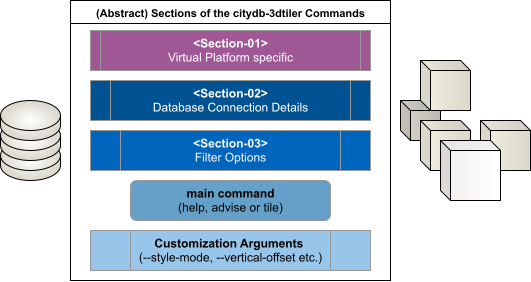

# Example Commands for Advanced Use

This page lists sample commands used when testing the application with various datasets. 

> Please note that some parameters, such as custom attribute names, may vary depending on the selected datasets.

## Command Line Sections



This application has been published as Docker images in two different repositories (ghcr.io & docker.io) and can also be run using only a Python virtual environment. The first section of the application commands will vary depending on your choice. The application consists of three main sections, one main command (advise,tile,help) and additional customization arguments.  The second section contains information about database connection. The third section allows you to filter the data in your database. 

Below, we’ll first explain how to configure these sections, followed by examples of how to vary the customization arguments. The first three sections will be referred to as \<Section-XX\> in the command-line examples that follow.

### Section-01 : Selected Virtual Platform

> If you'd like, you can replace the "latest" tag in the last row with any other fixed version number.

#### in a Container from Docker.io

=== "Powershell"

    ```powershell
    docker run `
    --rm --interactive --tty `
    --name citydb-3dtiler `
    --volume ./:/home/tester/citydb-3dtiler/shared:rw `
    tumgis/citydb-3dtiler:latest `
    ```

=== "Linux Terminal"

    ```bash
    docker run \
    --rm --interactive --tty \
    --name citydb-3dtiler \
    --volume ./:/home/tester/citydb-3dtiler/shared:rw \
    tumgis/citydb-3dtiler:latest \
    ```

=== "Command Prompt (CMD)"

    ```bash
    docker run ^
    --rm --interactive --tty ^
    --name citydb-3dtiler ^
    --volume ./:/home/tester/citydb-3dtiler/shared:rw ^
    tumgis/citydb-3dtiler:latest ^
    ```


#### in a Container from ghcr.io


=== "Powershell"

    ```powershell
    docker run `
    --rm --interactive --tty `
    --name citydb-3dtiler `
    --volume ./:/home/tester/citydb-3dtiler/shared:rw `
    ghcr.io/tum-gis/citydb-3dtiler:latest `
    ```

=== "Linux Terminal"

    ```bash
    docker run \
    --rm --interactive --tty \
    --name citydb-3dtiler \
    --volume ./:/home/tester/citydb-3dtiler/shared:rw \
    ghcr.io/tum-gis/citydb-3dtiler:latest \
    ```

=== "Command Prompt (CMD)"

    ```bash
    docker run ^
    --rm --interactive --tty ^
    --name citydb-3dtiler ^
    --volume ./:/home/tester/citydb-3dtiler/shared:rw ^
    ghcr.io/tum-gis/citydb-3dtiler:latest ^
    ```


#### in a Virtual Environment using Python Venv

> For Python Installation check the [page](how_to_use_w_venv.md)

> Do not forget to install python dependencies using ```pip install requirements.txt``` command.

=== "Powershell"

    ```powershell
    python citydb-3dtiler.py `
    ```

=== "Linux Terminal"

    ```bash
    python3 citydb-3dtiler.py \
    ```

=== "Command Prompt (CMD)"

    ```bash
    python citydb-3dtiler.py ^
    ```


### Section-02 : Database Connection Details

=== "Powershell"

    ```powershell
    # <Section-01> `
    --db-host 10.162.246.195 --db-port 9876 `
    --db-name citydb-visualizer `
    --db-schema citydb `
    --db-username tester --db-password louvre `
    ```

=== "Linux Terminal"

    ```bash
    # <Section-01> \
    --db-host 10.162.246.195 --db-port 9876 \
    --db-name citydb-visualizer \
    --db-schema citydb \
    --db-username tester --db-password louvre \
    ```

=== "Command Prompt (CMD)"

    ```bash
    # <Section-01> ^
    --db-host 10.162.246.195 --db-port 9876 ^
    --db-name citydb-visualizer ^
    --db-schema citydb ^
    --db-username tester --db-password louvre ^
    ```


### Section-03 : Filter Options

> Consider that the namespace separator and the nested object separators are different than the standard CityGML notation. Please check the advise document before typing the names of the features and properties.

#### Filter by TypeName (ObjectClass)

>The term "TypeName" refer to the ObjectClass which is available as a table with the same name. Check the advice.yml file to see a list of the existing typenames/objectclasses.

=== "Powershell"

    ```powershell
    # <Section-01> `
    # <Section-02> `
    --type-name GroundSurface,WallSurface,RoofSurface `
    ```

=== "Linux Terminal"

    ```bash
    # <Section-01> \
    # <Section-02> \
    --type-name GroundSurface,WallSurface,RoofSurface \
    ```

=== "Command Prompt (CMD)"

    ```bash
    # <Section-01> ^
    # <Section-02> ^
    --type-name GroundSurface,WallSurface,RoofSurface ^
    ```

#### Filter by ID (objectid)

> The term "ID" refer to the "objectid" column of the "feature" table. The same term is known as "gml:id" in CityGML terminology.

=== "Powershell"

    ```powershell
    # <Section-01> `
    # <Section-02> `
    --id --id ID_B27AC6BF-787E-4AEC-A976-4B14660FEFC9,ID_A8A5F86D-B11C-4414-B671-19F7A8C854D9,ID_5973075F-DAF5-4979-BF91-B1CEE7AE1A6E `
    ```

=== "Linux Terminal"

    ```bash
    # <Section-01> \
    # <Section-02> \
    --id --id ID_B27AC6BF-787E-4AEC-A976-4B14660FEFC9,ID_A8A5F86D-B11C-4414-B671-19F7A8C854D9,ID_5973075F-DAF5-4979-BF91-B1CEE7AE1A6E \
    ```

=== "Command Prompt (CMD)"

    ```bash
    # <Section-01> ^
    # <Section-02> ^
    --id --id ID_B27AC6BF-787E-4AEC-A976-4B14660FEFC9,ID_A8A5F86D-B11C-4414-B671-19F7A8C854D9,ID_5973075F-DAF5-4979-BF91-B1CEE7AE1A6E ^
    ```


### Main Commands

#### help

> For the "help" command, you don't need to use any Database Connection info or Filter Option. The only need is the section-01 (virtualization).

> Note that just like the main "help" (-h / --help) command, all the commands have their own help documents which will provide a subset of the arguments.

=== "Powershell"

    ```powershell
    # <Section-01> `
    help
    ```

=== "Linux Terminal"

    ```bash
    # <Section-01> \
    help
    ```

=== "Command Prompt (CMD)"

    ```bash
    # <Section-01> ^
    help
    ```


#### advise

> For the "advise" command, you don't need to use any Filter Option. You only need to specify the section-01 and section-02 (virtualization and database connection.)
> 
> The "advise" command is creating a YAML file (in default : "advice.yml") in the current folder. You can check this document to see a summary about the existing dataset.

=== "Powershell"

    ```powershell
    # <Section-01> `
    # <Section-02> `
    advise `
    --output-file muenchen3d.yml
    ```

=== "Linux Terminal"

    ```bash
    # <Section-01> \
    # <Section-02> \
    advise \
    --output-file muenchen3d.yml
    ```

=== "Command Prompt (CMD)"

    ```bash
    # <Section-01> ^
    # <Section-02> ^
    advise ^
    --output-file muenchen3d.yml
    ```


#### tile

> Filter Options (\<Section-03\>) are not mandatory. You can tile the hole dataset at once without filtering it.

> You can save tilesets to a specific folder by adding the “**--output-folder**” argument.

=== "Powershell"

    ```powershell
    # <Section-01> `
    # <Section-02> `
    # <Section-03> `
    tile
    ```

=== "Linux Terminal"

    ```bash
    # <Section-01> \
    # <Section-02> \
    # <Section-03> \
    tile
    ```

=== "Command Prompt (CMD)"

    ```bash
    # <Section-01> ^
    # <Section-02> ^
    # <Section-03> ^
    tile
    ```

### Customization Arguments