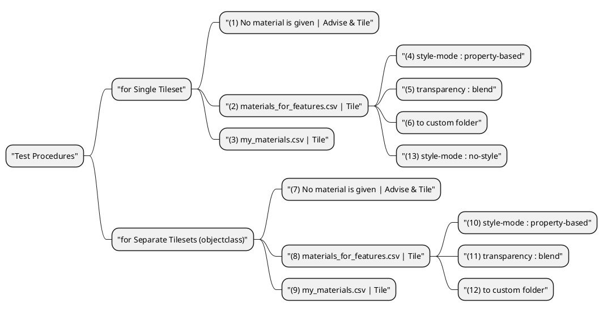

# Test Procedures

## Test Procedures Diagram

## Former Tests

- Before release 0.9
    - [Tests done for SamplyCity Dataset](https://www.3dcitydb.net/3dcitydb/fileadmin/public/kendir/#test_campaign_03_samplycity){:target="_blank"}
- Test with Hamburg LoD3 dataset
    - [Hamburg Buildings LoD3](https://www.3dcitydb.net/3dcitydb/fileadmin/public/kendir/#test_campaign_02_hamburg){:target="_blank"}
- Test with Melbourne dataset
    - [Melbourne Buildings & Roads](https://www.3dcitydb.net/3dcitydb/fileadmin/public/kendir/#tests_for_3dtiler_melbourne){:target="_blank"}

