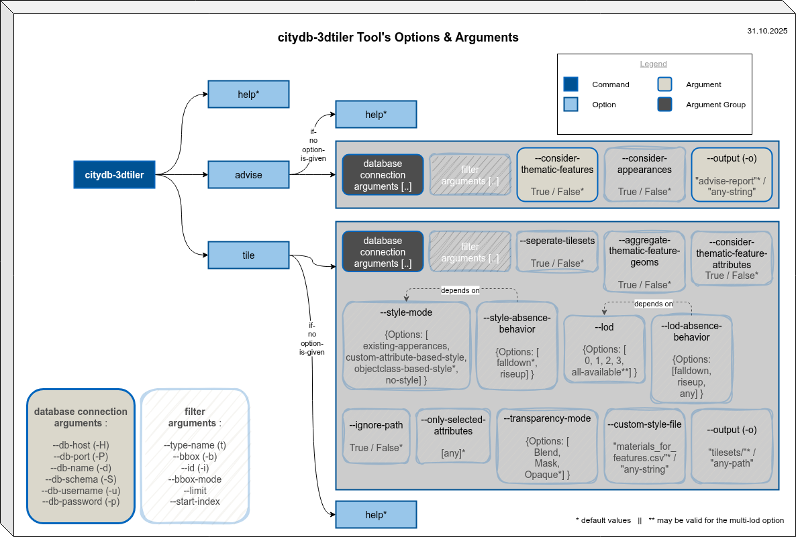
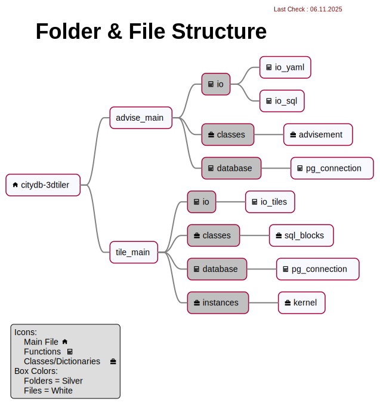
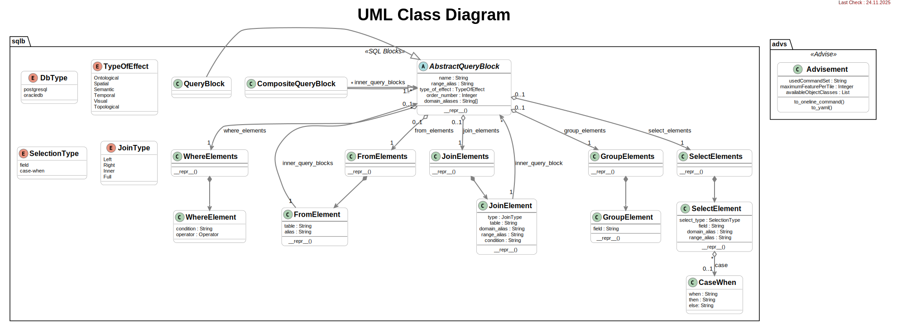

# citydb-3dtiler

<blockquote>
Generates 3D Tiles by connecting to a 3DCityDB (v5) database instance with the provided custom arguments.
</blockquote>

## For Docker Users :

### Build

Pattern:

```bash
docker build --tag IMAGENAME:VERSIONorTAG .
```

Sample

```bash
docker build -t citydb-3dtiler:0.8 .
```

### Run the Container

Pattern:

Sample 1 (Run the **advise** command):

```bash
docker run --rm --interactive \
--name citydb-3dtiler08 \
--volume ./materials_for_features:/home/tester/citydb-3dtiler/materials_for_features:rw \
--volume ./output:/home/tester/citydb-3dtiler/output \
citydb-3dtiler:0.8 \
-H 10.162.246.195 -P 9876 -d citydb-visualizer \
-S citydb -u tester -p 123456 \
advise
```

Sample 2 (Run the **tile** command):

```bash
docker run --rm --interactive \
--name citydb-3dtiler08 \
--volume ./materials_for_features:/home/tester/citydb-3dtiler/materials_for_features:rw \
--volume ./output:/home/tester/citydb-3dtiler/output \
citydb-3dtiler:0.8 \
-H 10.162.246.195 -P 9876 -d citydb-visualizer \
-S citydb -u tester -p 123456 \
tile
```

### Check the Container itself (for development purposes)

Sample (Overwrite the Entrypoint):

```bash
docker run --rm --interactive --tty \
--volume ./materials_for_features:/home/tester/citydb-3dtiler/materials_for_features:rw \
--volume ./output:/home/tester/citydb-3dtiler/output \
--name citydb-3dtiler08 \
--entrypoint /bin/bash \
citydb-3dtiler:0.8
```

### Remove all the relevant containers, images etc.

All-in-One Command:

```bash
docker rm --force $(docker ps --all --quiet --filter label=composition=citydb-3dtiler) \
&& docker rmi --force $(docker image list --quiet --filter label=composition=citydb-3dtiler)
```
<details>
<summary>Remove Containers:</summary>

```bash
docker rm --force $(docker ps --all --quiet --filter label=composition=citydb-3dtiler)
```

</details>

<details>
<summary>Remove Images:</summary>

```bash
docker rmi --force $(docker image list --quiet --filter label=composition=citydb-3dtiler)
```

</details>

## DOC for DEV :

<figure style="width:%100;text-align: center;">
  
  <figcaption>Using the Application (Semi-transparent sketched boxes indicate features that have not yet been implemented.)</figcaption>
</figure>

<hr>

<figure style="width:%100;text-align: center;">
  
  <figcaption>Current Structure of Files & Folders</figcaption>
</figure>

<hr>

<figure style="width:%100;text-align: center;">
  
  <figcaption>UML Class Diagram of the app</figcaption>
</figure>

<hr>

## Test Procedure

> Each command should be checked once when a milestone is achieved.

### 1. Check the **help** documentation

```bash
python3 citydb-3dtiler.py --help
```
<details>
<summary>1.1. Help doc for advise command</summary>

```bash
python3 citydb-3dtiler.py advise --help
```

</details>
<details>
<summary>1.2. Help doc for tile command</summary>

```bash
python3 citydb-3dtiler.py tile --help
```

</details>

### 2. Check the **advise** command

2.1. *advise for* **single tileset**

```bash
python3 citydb-3dtiler.py \
-H localhost -P 9876 -d citydb-visualizer -S citydb -u tester -p 123456 \
advise
```

2.2. *advise for* **separate tilesets**

2.2.1. *advise for separate tilesets* considering Object Classes

```bash
python3 citydb-3dtiler.py \
-H localhost -P 9876 -d citydb-visualizer -S citydb -u tester -p 123456 \
--separate-tilesets objectclass \
advise
```

### 3. Check the **tile** command

3.1. *tile as* **single tileset**

3.1.1. *tile as single tileset with* **Objectclass-based** *style-mode (default)*

```bash
python3 citydb-3dtiler.py \
-H localhost -P 9876 -d citydb-visualizer -S citydb -u tester -p 123456 \
--tilers-path tiler_app --tiler-app pg2b3dm \
tile \
--style-mode objectclass-based --style-absence-behavior fall-down
```

3.1.2. *tile as single tileset with* **property-based** *style-mode*

```bash
python3 citydb-3dtiler.py \
-H localhost -P 9876 -d citydb-visualizer -S citydb -u tester -p 123456 \
--tilers-path tiler_app --tiler-app pg2b3dm \
tile \
--style-mode property-based --style-absence-behavior fall-down
```

3.2. *tile as* **separate tilesets**

3.2.1. *tile as separate tilesets with* **objectclass-based** *style-mode (default)*

```bash
python3 citydb-3dtiler.py \
-H localhost -P 9876 -d citydb-visualizer -S citydb -u tester -p 123456 \
--tilers-path tiler_app --tiler-app pg2b3dm \
--separate-tilesets objectclass \
tile \
--style-mode objectclass-based --style-absence-behavior fall-down
```

3.2.2. *tile as separate tilesets with* **property-based** *style-mode*

```bash
python3 citydb-3dtiler.py \
-H localhost -P 9876 -d citydb-visualizer -S citydb -u tester -p 123456 \
--tilers-path tiler_app --tiler-app pg2b3dm \
--separate-tilesets objectclass \
tile \
--style-mode property-based --style-absence-behavior fall-down
```

<hr>


