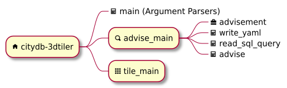

# citydb-3dtiler

<blockquote>
Generates 3D Tiles by connecting to a 3DCityDB (v5) database instance with the provided custom arguments.
</blockquote>

<figure style="width:%100;text-align: center;">
  
  <figcaption>Using the Application (Semi-transparent sketched boxes indicate features that have not yet been implemented.)</figcaption>
</figure>

<figure style="width:%100;text-align: center;">
  
  <figcaption>Current Structure of Files & Objects (2025-10)</figcaption>
</figure>
